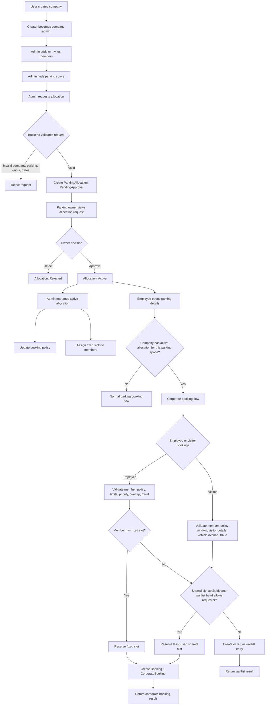
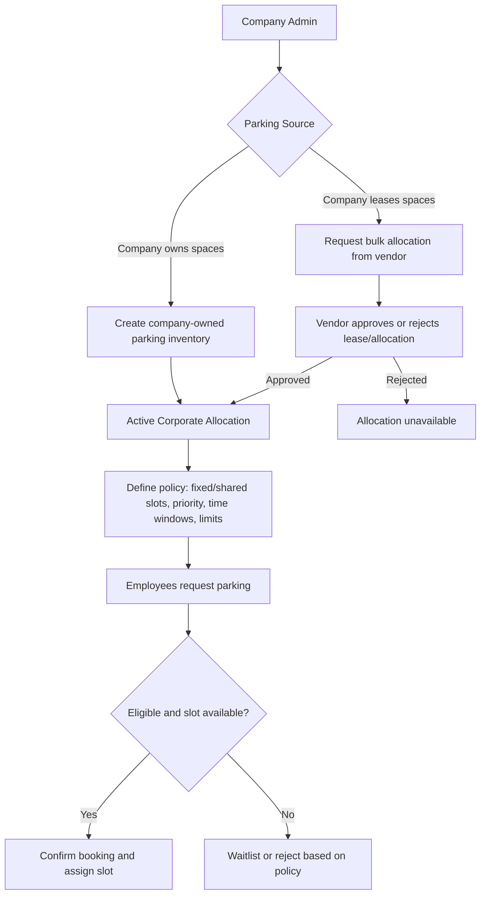

# Corporate Parking Flow

## Implementation Status

| Area | Status | Evidence |
| --- | --- | --- |
| Company creation | Implemented | `CorporateController.CreateCompany`, `CreateCompanyHandler`, `Company.Create` |
| Company switcher / corporate mode | Implemented | `frontend/src/components/CompanySwitcher.jsx`, `CompanyContext.jsx` |
| Add existing member | Implemented in backend and frontend | `POST /companies/{companyId}/members`, `CompanyMembers.jsx` |
| Invite member and accept invite | Implemented | `InviteMemberHandler`, `AcceptInvitationHandler`, `AcceptInvitation.jsx` |
| Request allocation API | Implemented in backend service layer | `POST /companies/{companyId}/allocations`, `AllocateParkingSlotsHandler` |
| Allocation quota validation | Implemented | `Quota.Create`, `Company.RequestAllocation` |
| Allocation owner approval/rejection API | Implemented in backend | `POST /allocations/{allocationId}/approve`, `POST /allocations/{allocationId}/reject` |
| Vendor allocation request list | Implemented | `GET /vendor/allocations`, `GetVendorAllocationsHandler`, `VendorBookings.jsx` |
| Allocation list for company admin | Implemented | `GetCompanyAllocationsHandler`, `CompanyAllocations.jsx` |
| Allocation request UI | Implemented | `ParkingDetails.jsx`, `corporateService.requestAllocation()` |
| Booking policy update | Implemented | `UpdateBookingPolicyHandler`, `CompanyAllocations.jsx` |
| Fixed slot assignment | Implemented | `AssignFixedSlotHandler`, `ParkingAllocation.AssignFixedSlot`, `CompanyAllocations.jsx` |
| Fixed slot removal | Implemented | `RemoveFixedSlotHandler`, `ParkingAllocation.RemoveFixedAssignment`, `CompanyAllocations.jsx` |
| Employee corporate booking | Implemented | `BookCorporateParkingHandler`, `Company.ReserveEmployeeParking`, `ParkingDetails.jsx` |
| Visitor corporate booking | Implemented | `BookVisitorParkingHandler`, `Company.ReserveVisitorParking`, `ParkingDetails.jsx` |
| Shared slot assignment | Implemented | `ParkingAllocation.ResolveSharedSlotReservation` |
| Waitlist creation and ordering | Implemented in domain and booking handlers | `CorporateWaitlistEntry`, `Company.GetWaitlistPosition` |
| Waitlist list/cancel | Implemented | `GET /companies/{companyId}/waitlist`, `DELETE /companies/{companyId}/waitlist/{waitlistEntryId}`, `CompanyAllocations.jsx` |
| Waitlist promotion | Implemented | `POST /companies/{companyId}/waitlist/{waitlistEntryId}/promote`, `PromoteWaitlistEntryHandler`, `CompanyAllocations.jsx` |
| Corporate booking billing semantics | Implemented | Corporate bookings are confirmed immediately; `ReservedSlots` bills `0`, usage-based bookings retain `TotalAmount` for reporting/invoicing |
| Corporate dashboard | Implemented | `GetCompanyDashboardHandler`, `CorporateDashboard.jsx` |
| Corporate booking list | Backend implemented | `GET /companies/{companyId}/bookings`, `GetMemberBookingsHandler` |

## Remaining Product Decisions

1. Fully automatic waitlist promotion is not enabled.

   The app can create, list, order, cancel, and manually promote waitlist entries. A background job that promotes entries without an admin click is still a product choice because it creates bookings on behalf of users.

2. External invoicing is outside this module.

   Usage-based corporate bookings keep calculated amounts on the booking record for reporting. Actual invoice generation/settlement is not implemented in this module.

3. Some corporate hook coverage remains thin.

   `frontend/src/hooks/useCorporate.js` has been aligned with `corporateService.js`, but the current pages mostly call the service directly. It should either be adopted consistently or removed later.

4. Backend and frontend build verification passed after allowing NuGet access.

   `npm run build`, `dotnet build backend/src/ParkingApp.API/ParkingApp.API.csproj -v minimal`, and `dotnet test backend/tests/ParkingApp.UnitTests/ParkingApp.UnitTests.csproj --filter "CompanyAggregateTests" -v minimal` passed.

## Target Corporate Parking Model

Corporate parking should support two acquisition paths that feed the same internal allocation and booking engine.

Architectural principle: do not build two employee booking systems. Owned and leased parking should differ only in how corporate inventory becomes available. Once an allocation is active, employee booking, fixed slot assignment, shared slot selection, waitlist, dashboard, and reporting should be common.

## Requirements

### Functional Requirements

| ID | Requirement | Current Status |
| --- | --- | --- |
| CP-01 | Company admins can create and manage a corporate account. | Implemented |
| CP-02 | Company admins can invite/add employees and assign roles/priorities. | Implemented |
| CP-03 | Company admins can request bulk parking from vendor-owned spaces. | Implemented |
| CP-04 | Vendors can approve/reject corporate bulk allocation requests. | Implemented |
| CP-05 | Active allocations support fixed slots and shared slots. | Implemented |
| CP-06 | Employees can book against active corporate allocations. | Implemented |
| CP-07 | Visitors can book against active corporate allocations. | Implemented |
| CP-08 | Corporate booking policy controls limits, priority, hours, and weekends. | Implemented |
| CP-09 | Waitlist can be created, viewed, cancelled, and manually promoted. | Implemented |
| CP-10 | Company admins can create company-owned parking spaces directly. | Implemented |
| CP-11 | Company-owned parking spaces bypass vendor approval. | Implemented |
| CP-12 | System stores parking source type: owned, leased/vendor-provided. | Implemented |
| CP-13 | Admin can convert company-owned spaces into active internal allocations. | Implemented |
| CP-14 | Corporate dashboard distinguishes owned, leased, active, pending, expired inventory. | Partially implemented |
| CP-15 | Search/allocation UI clearly separates “lease from vendor” from “use company-owned parking”. | Implemented for owned inventory page; leased request still starts from parking details/search |
| CP-16 | Lease metadata can be tracked: lease reference, vendor, start/end, price/billing terms. | Missing |
| CP-17 | Company-owned parking can be edited, activated/deactivated, and retired. | Partially implemented: activate/deactivate is implemented; edit/retire are pending |
| CP-18 | Optional automatic waitlist promotion job. | Product decision pending |
| CP-19 | External invoicing/settlement for leased parking. | Product decision pending |

### Non-Functional Requirements

| Area | Requirement |
| --- | --- |
| Authorization | Only company admins can create company-owned spaces, approve internal allocation setup, and manage policies. Employees can only request/book according to policy. |
| Auditability | Track who created inventory, who approved allocations, who assigned fixed slots, and who changed policy. |
| Tenant isolation | Company-owned inventory and allocations must be scoped by company ID. No cross-company visibility. |
| Reuse | Corporate-owned and vendor-leased spaces must reuse the existing allocation, booking, waitlist, and dashboard logic where possible. |
| Data integrity | Allocated fixed/shared slots cannot exceed the physical or leased slot count. |
| Reporting | Dashboard should show owned capacity, leased capacity, utilization, waitlist pressure, and upcoming expiry. |

## Implementation Plan

### Phase 1: Domain Model Cleanup

1. Add parking source classification.

   Introduce a source concept such as:

   - `ParkingSpaceOwnershipType`: `IndividualVendor`, `CompanyOwned`
   - `ParkingAllocationSource`: `VendorLease`, `CompanyOwned`

   Recommendation: keep `ParkingSpace` as the physical inventory entity, and add ownership/source fields instead of creating a separate corporate parking table. This avoids duplicating booking availability, location, pricing, images, and slot behavior.

2. Add company ownership link.

   Extend `ParkingSpace` with nullable corporate ownership fields:

   - `CompanyOwnerId`
   - `CreatedByCompanyAdminId`
   - `OwnershipType`
   - `IsCorporateOnly`

   Rule: vendor-owned spaces use `OwnerId`; company-owned spaces use `CompanyOwnerId`. A company-owned space should not require vendor approval for allocation.

3. Extend `ParkingAllocation`.

   Add:

   - `SourceType`
   - `VendorId` nullable
   - `LeaseReference` nullable
   - `LeaseAmount` nullable
   - `ApprovedByUserId` nullable
   - `ApprovedAt` nullable

   Rule: `CompanyOwned` allocations can become `Active` immediately if created by a company admin.

### Phase 2: Backend APIs

1. Create company-owned parking APIs.

   Add endpoints under corporate context:

   - `POST /api/v1/corporate/companies/{companyId}/parking-spaces`
   - `GET /api/v1/corporate/companies/{companyId}/parking-spaces`
   - `PUT /api/v1/corporate/companies/{companyId}/parking-spaces/{parkingSpaceId}`
   - `DELETE` or `PATCH deactivate /api/v1/corporate/companies/{companyId}/parking-spaces/{parkingSpaceId}`

2. Create internal allocation API.

   Add:

   - `POST /api/v1/corporate/companies/{companyId}/parking-spaces/{parkingSpaceId}/allocations`

   This creates an active allocation directly from company-owned inventory.

3. Update existing allocation request flow.

   Keep current vendor request endpoint for leased spaces:

   - `POST /companies/{companyId}/allocations`

   Add validation:

   - Vendor-owned spaces require vendor approval.
   - Company-owned spaces reject the vendor request flow and must use the internal allocation flow.
   - Requested slots cannot exceed parking capacity or available leased capacity.

4. Update queries and DTOs.

   Allocation list and dashboard responses should include:

   - source type
   - ownership type
   - vendor/company owner name
   - approval status
   - lease dates
   - total owned slots vs leased slots

### Phase 3: Frontend UX

1. Add Corporate Parking Inventory page.

   New route:

   - `/corporate/parking-spaces`

   Admin capabilities:

   - create company-owned parking
   - edit location/capacity/details
   - activate/deactivate inventory
   - create internal allocation from owned inventory

2. Update corporate navigation.

   Add:

   - Corporate Dashboard
   - Parking Inventory
   - Allocations
   - Members

3. Update allocation request UX.

   Split the admin workflow into two clear paths:

   - “Use company-owned parking”
   - “Request leased parking from vendor”

4. Update Company Allocations page.

   Show badges:

   - `Owned`
   - `Leased`
   - `Pending Vendor Approval`
   - `Active`
   - `Expired`

5. Update Corporate Dashboard.

   Add cards:

   - owned spaces
   - leased spaces
   - active allocations
   - pending vendor approvals
   - utilization
   - waitlist count
   - leases expiring soon

### Phase 4: Data Migration

1. Add new columns with safe defaults.

   Existing parking spaces should default to `IndividualVendor`.

2. Existing corporate allocations should default to `VendorLease`.

3. Backfill `VendorId` from parking space owner where possible.

4. Add indexes:

   - `ParkingSpaces.CompanyOwnerId`
   - `ParkingSpaces.OwnershipType`
   - `ParkingAllocations.SourceType`
   - `ParkingAllocations.CompanyId, SourceType, Status`

### Phase 5: Tests

Backend unit/integration tests:

1. Company admin can create company-owned parking.
2. Non-admin cannot create company-owned parking.
3. Company-owned allocation becomes active without vendor approval.
4. Vendor-owned allocation remains pending until vendor approval.
5. Company-owned allocation cannot exceed physical capacity.
6. Vendor-leased allocation cannot exceed approved leased capacity.
7. Employee booking works identically for owned and leased allocations.
8. Dashboard counts owned and leased capacity separately.

Frontend tests/manual checks:

1. Switch to corporate mode opens corporate dashboard.
2. Corporate admin can create owned parking.
3. Corporate admin can create allocation from owned parking.
4. Employee can book owned allocation.
5. Employee can book leased allocation.
6. Personal/corporate mode switching does not show incorrect error toast.

## Recommended Delivery Order

1. Implement source/ownership fields and migration.
2. Add company-owned parking backend APIs.
3. Add internal allocation creation for company-owned spaces.
4. Update allocation/dashboard DTOs.
5. Build corporate parking inventory page.
6. Update dashboard and allocation UI badges.
7. Add tests and run full frontend/backend verification.

This order keeps risk low because it preserves the current vendor-leased flow while adding corporate-owned inventory beside it.

## Implementation Update

The core company-owned parking path is now implemented:

- `ParkingSpace` supports `CompanyOwnerId`, `OwnershipType`, and `IsCorporateOnly`.
- `ParkingAllocation` supports `SourceType`.
- Company-owned inventory is excluded from public search/map listings.
- Company admins can create company-owned parking from `/corporate/parking-spaces`.
- Company admins can create an active allocation directly from owned inventory.
- Vendor-leased allocations continue to require parking owner approval.
- Corporate dashboard exposes owned parking, owned slots, leased allocations, and pending vendor approvals.
- Migration `20260504173000_AddCorporateOwnedParking` adds the required database fields and indexes.

Remaining follow-up work:

1. Add edit/retire workflows for company-owned parking spaces.
2. Decide whether leased parking should get a dedicated corporate leasing page instead of starting from public parking details.
3. Add external invoicing/settlement if the product needs billing beyond internal reporting.
